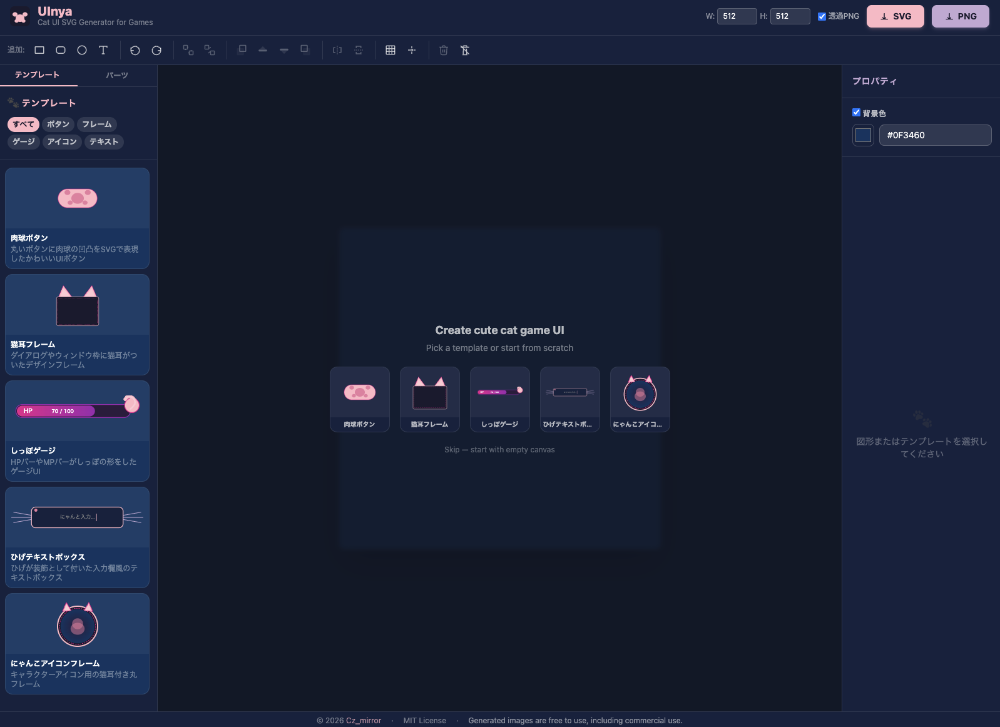

# **UInya 🐱**

**Cat UI SVG Generator for Games**

Generate cute **cat-themed game UI assets** as **SVG or PNG** directly in the browser.

UInya is a lightweight editor for creating cat-styled UI elements such as buttons, frames, gauges and icons.

It runs entirely in the browser and exports clean SVG assets ready for games or web apps.

---

## **Demo**

  

Try it here:

  

https://czmirror.github.io/UInya/

---

## **Features**

- SVG / PNG export
    
- Cat-themed UI templates
    
- Decoration parts (ears, eyes, paws, tail, etc.)
    
- Customizable colors
    
- Transform tools (move / rotate / scale)
    
- Lightweight browser editor
    
- No login required
    
- No backend processing
    

---

## **Example UI Elements**

  

UInya can generate UI assets such as:

- cat ear dialog frames
    
- paw-style buttons
    
- tail shaped gauges
    
- cat icon frames
    
- decorative UI elements
    

  

You can combine templates and parts to quickly prototype a game interface.

---

## **Basic Workflow**

1. Select a template or part from the sidebar
    
2. Place it on the canvas
    
3. Adjust color, size, rotation or position
    
4. Combine multiple elements
    
5. Export as SVG or PNG
    

---

## **Why UInya?**

  

Many asset generators focus on characters.

  

UInya focuses on **UI components for games**.

  

It is designed for developers who want quick UI placeholders or stylized assets without opening a full design tool.

---

## **License**

  

MIT License

  

Generated images are free to use, including commercial use.

---

## **Roadmap**

  

- [x] grid guide
- [x] snap positioning
- [x] flip transforms
- [ ] line / bezier drawing tools
- [ ] random cat generator
- [ ] additional UI templates
    

---

## **Contributing**

  

Issues and pull requests are welcome.

  

If you have ideas for new templates or parts, feel free to open an issue.